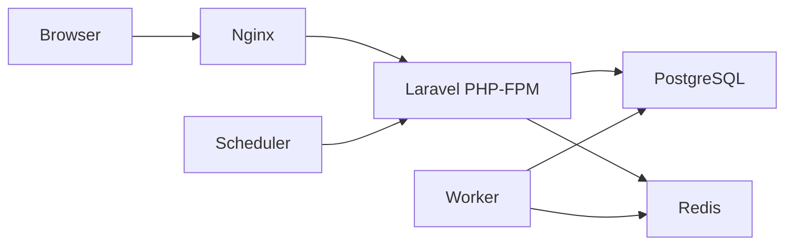

# Arquitetura

## Estilo

Monólito Laravel modular.

## Componentes

- Nginx: entrada HTTP e arquivos estáticos;
- PHP-FPM: aplicação Laravel;
- PostgreSQL: estado relacional e Markdown;
- Redis: cache, sessões, filas e locks;
- worker: processamento assíncrono;
- scheduler: tarefas periódicas;
- Vite: assets em desenvolvimento.

## Regras

- PostgreSQL e Redis não publicam portas por padrão;
- app, worker e scheduler usam a mesma imagem;
- tarefas pesadas vão para jobs;
- o browser não acessa banco ou Redis;
- autorização fica no backend;
- o mobile futuro usa HTTP API, não acesso ao banco.
